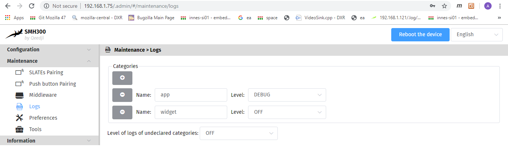
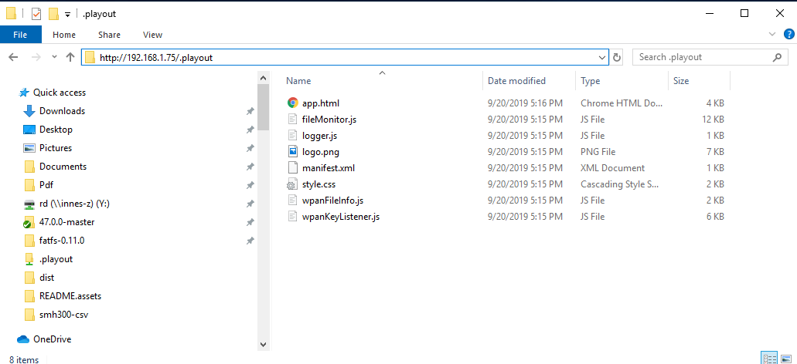

## SMH300 SignDoor CSV example

This is an  to load a .csv file containing contact information for an office and generating a picture to be displayed on a set of Slates.
You should at least have one Slate paired to your SMH300 to see the result of the app.

## Setup the example

### Enable app logs

This app uses logs to demonstrate some functionalities. Enable a logger **"app"** in **DEBUG** level as shown in the logger documentation.

### Configuration of data.csv file

* The file must be named **data.csv**.
* Don't modify the first row of the file.
* Each office can contain up to two contacts information.
* For each contact information, **both name and role must be fill**.
* The **second row** of the .csv file is the information for the **first office**. It generates the picture associated to the first Slate in the SMH300 configuration.
* The row below is the information for the second office generates, the picture for the second Slate, and so on.
* Up to 20 offices can be set.

Here is an example of configuration for the Slates of ID 1 and ID 2:

In this :
*  **Office 10** will be displayed on the Slate of ID 1 and will contain 2 contacts.
*  **Office 11** will be displayed on the Slate of ID 2 and will contain 1 contact.

You can find this data.csv file in this app directory.

### Upload data.csv to the hub device

Once you have configured your data.csv file, you must upload it to the hub device using a webdav client. Find two ways to do it below.

#### MS-Windows File Explorer

First of all, open a MS-Windows File Explorer. Then in the File Explorer path bar, enter the path to your hub device's the webdav's playout: "**http://`<device_ip>`/.playout**", where **`<device_ip>`** is the IP address of your hub device.

Here are some picture to illustrate this operation for a device with the IP address 192.168.1.75:

Global windows view:

File Explorer close-up:

Then simply copy, move or modify the data.csv file into the folder and the app will generate the corresponding Slate pictures.

#### Using curl command line

Another way to upload the data.csv file is to use the built-in curl command on windows.
To do so, open a command prompt using Windows search engine:

In the command prompt interface execute the following command:

**curl --anyauth --user `<username>`:`<password>`  -T `<data.csv_file_path>`  http://`<device_ip>`/.playout/data.csv**

With **`<data.csv_file_path>`** the path to the data.csv file, **`<device_ip>`** is the IP address of your hub device, **`<username>`** and **`<password>`** the identification for your hub device.

Here is an example with **`<data.csv_file_path>`** being "C:\Users\Utilisateur\Desktop\data.csv", **`<device_ip>`** 192.168.1.75,  **`<username>`** admin and **`<password>`** admin.

## Source files explanation

### fileMonitor.js

Uses the fileSystemWatcher component to check the file system for add, remove or modification in the playout folder of the hub device. It checks if it is the data.csv file containing the data needed to generate the pictures. If it is the data file, it parses it and generates the pictures for each Slate.

### wpanFileInfo.js

Simple component that does a polling every minute to check if the Slates picture files are synchronized with the one generated last on the hub device. If a download from a Slate happened, it will also write the time of the last download in the log file.

By default, only the first 2 Slates are checked, and the polling happens every minute. You can configure this by editing the top of the file.

### wpanKeyListener.js

This is a component that listens to HID events and spread them on the network via UDP multicast. It manages events from Slates as well as events from WPAN push buttons such as BLE EnOcean.
