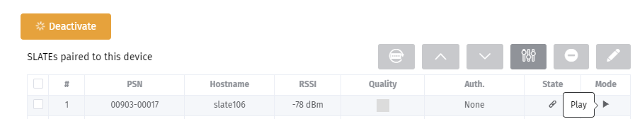

# SMH300-demo1 App (WPAN and NFC)

This App is an example to show some interactivity possibilities between the `SMH300` device and WPAN peripherals. 

These WPAN peripherals can be:
- `Qeedji` devices:
    - `SLATE106` (interactivity with middle button and NFC)  
- `EnOcean` devices: 
    - Motion sensors,
    - Presence sensor with accelerometers,
    - Push-buttons.

**Compatibilitity**:
- `SLATE106`:
    - PSN 00903-xxxxx (or above) to support `SLATE106` middle key
- `Gekkota OS` 4.13.11 for device `SMH300`:
    - embedding `Pictureframe` 1.11.11 for device `SLATE106` 
- `App`: 
	- This App exmaple is designed to work with only one `SLATE106` paired to the `SMH300` on the index `1`

This App creates a picture each time a WPAN event is received from one of the paired device and is printing some consistent information regarding the paired device. 

The generated picture can be viewed: 
- either on a `SLATE106` device
- or by simply taking a look on the appropriate SMH300 WebDAV directory with a Web browser:
    - ```http://<SMH300-IP-addr>/.output/<index>```

**Before making any association, check first that your SMH300 date and time are correct**
Connect to the SMH300 configuration Web interface by entering ```http://`<SMH300_IP_addr>`/``` in a Web browser:
- click on the `Administration console` button on the top right corner,
- go in the menu `Date and time`, and click on the input `UTC date and time`. Click on the button now.

## 1. SMH300 configuration to match the App usage

**1.1. Associate the motion sensors**

Connect to the SMH300 configuration Web interface by entering ```http://<SMH300_IP_addr>/``` in a Web browser:
- click on the `Administration console` button on the top right corner, 
- in the `Configuration` tab of the WebUI, select the `Sensors Pairing` menu.


- click on the `Activate` button and wait for the motion sensors device is detected by the SMH300. When it is appearing in the left list, then 
- drop the wished motion sensor device to the right list to pair it with the SMH300 (whatever the index). 

For further information to pair an EnOcean motion sensor, refer to the **SMH300 installation manual 4.13.11**.

**1.2. Associate the push buttons**

Connect to the SMH300 configuration Web interface by entering ```http://<SMH300_IP_addr>/``` in a Web browser:
- click on the `Administration console` button on the top right corner, 
- in the `Configuration` tab of the WebUI, select the `Push buttons Pairing` menu,
 


- click on the `Activate` button, 
- press on one of the button (0,1,+,-) and wait for the push button device is detected by the SMH300. When it is appearing in the left list, then 
- drop the wished push button device to the right list to pair it with the SMH300 (whatever the index). 

For further information to pair an EnOcean push button, refer to the **SMH300 installation manual 4.13.11**.

**1.3. Associate the SLATE106 device**

Note previously the `SLATE106` PSN value at the back of the product to be able to detect it during the WPAN scan.

Connect to the SMH300 configuration Web interface by entering ```http://<SMH300_IP_addr>/``` in a Web browser: 
- click on the `Administration console` button on the top right corner, 
- in the `Configuration` tab of the WebUI, select the `SLATEs pairing` menu,


- click on the `Activate` button, 
- wait for a couple of time (until 15 minutes in the default configuration), the time for the `SLATE106` device to be detected by the SMH300. When it is appearing in the left list, then 
- drop the wished push button device to the index `1` of the right list to pair it with the SMH300 
    - double click on it to edit the `SLATE106` configuration and uncheck `Activate test card`,
    - click on the grey `Edit common preferences` button,
    	- in the `General` tab, 
	    	- check `Wake-up by vibration sensor` and set to *Activated* value the `Touch keys`,
    		- check that one of the `Active days` is matching the days of the demo with `SLATE106`: *Mo, Tu, We, Th, Fr*
    		- check that the `Active interval` is matching the working hours of the demo with `SLATE106`: from *8.00 AM* to *7.00 PM*  
- wait for a couple of time (until 15 minutes in the default configuration) the time for the `SLATE106` device to take the SMH300 configuration and is paired 
  


**1.4. NFC configuration**

If you want to test the App with an NFC tag: 
- procure a NFC tag compatible with the `SLATE106`. For further information, refer to the `SLATE106` installation manual. 
- you must change the SMH300 configuration so that the `SLATE106` is using the right NFC protocol.

Connect to the SMH300 configuration Web interface by entering ```http://<SMH300_IP_addr>/``` in a Web browser:
- click on the `Administration console` button on the top right corner, 
- in the `Configuration` tab of the WebUI, select the `SLATEs pairing` menu,
- click on the `Activate` button,
- click on the grey `Edit common preferences` button, 
- in the `General` tab, check `NFC` using protocol and choose the appropriate protocol corresponding to your NFC tag technology.  


Wait for a couple of time (until 15 minutes in the default configuration) the time for the `SLATE106` device to take the SMH300 configuration and is paired again.

In the default configuration, after a `NFC tag` event, the `SLATE106` is configured to send the `HID tag over WPAN`. So after a `NFC tag` event, the `SLATE106` has to wake-up again to update its picture. It is possible to improve the fluidity of the test by configuring the `SLATE106` to download immediately the picture after a NFC tag detection.

Connect to the SMH300 configuration Web interface by entering ```http://<SMH300_IP_addr>/``` in a Web browser:
- click on the `Administration console` button on the top right corner, 
- in the `Configuration` tab of the WebUI, select the `SLATEs pairing` menu,
- click on the `Activate` button,
- click on the grey `Edit common preferences` button,
- select the `Matrix` tab and select the matrix option as showed below:
	- after the event `NFC tag`: 
		-  `Send HID tag over WPAN1`,
		-  `Wait for a delay during WPAN1`, 2500 `ms`,
		-  `Folder synchronization over WPAN1`. 


Wait for a couple of time (until 15 minutes in the default configuration) the time for the `SLATE106` device to take the `SMH300` configuration and is paired again.


If the button `Deactivate` is displayed , click on it to terminate the configuration.

## 2. Load the App

Connect to the SMH300 configuration Web interface by entering ```http://<SMH300_IP_addr>/``` in a Web browser:
- click on the `Administration console` button on the top right corner,
- in the `Configuration` pane of the WebUI, select the `App` menu then in the right panel, select `Local deposit`, 
    - press on the `Drop file here or click to add one` button,
    - select the provided `...\smh300-demo1\dist\example.tar` App file,
    - click on the button `Load the App`.   

## 3. Display of the result picture 

Press the `SLATE106` middle key to display a picture related to the key pressed event.


Badge with your NFC tag above the NFC reader of the SLATE106 to display a picture related to the NFC tag event.


Press on one the button of 4 keys push button (`E215` model): 
- `ON` (key code 112),
- `OFF` (key code 114),
- `+` (key code 113),
- `+` (key code 115).


Move fastly the acceleration sensor to display a picture related to this sensor.


Simulate people moving in front of the motion sensor to pass the Magnetic contact from `Unoccupied` to `Occupied` to display a picture related to this sensor.


When you press the middle key or badging with a NFC tag on the `SLATE106`, you should see a red LED flashing until the image is downloaded. 

**3.1. In Web browser**

Connect to the SMH300 configuration Web interface by entering ```http://<SMH300_IP_addr>/.output/1/``` in a Web browser (for example: Google Chrome).
Click on the `hub.ppk` file (propriety image format) to view the image.


*You can refresh the picture as many time as you want to see the last event received by the app.*

**3.2 On a SLATE106**

After having trigged an SLATE106/NFC event or a SLATE106/Middle key event: 
- the `SMH300` is updating immediately the `hub.ppk` in the WebDAV directory ```http://<SMH300_IP_addr>/.output/1/``` and  
- the `SLATE016` is forced to update its content 2,5 sec after.

After having trigged an event EnOcean/sensor or EnOcean/push-button: 
- the SMH300 is updating immediately the `hub.ppk` in the WebDAV directory ```http://<SMH300_IP_addr>/.output/1/``` and
- wait for a couple of time (until 15 minutes in the default configuration) the time for the `SLATE106` device to wake-up and update its content.
- now the picture displayed on the `SLATE106` is the same as the one displayed in the WebDAV directory.