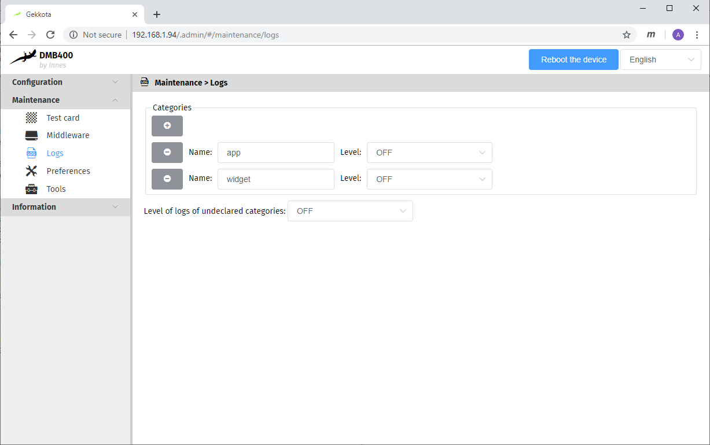
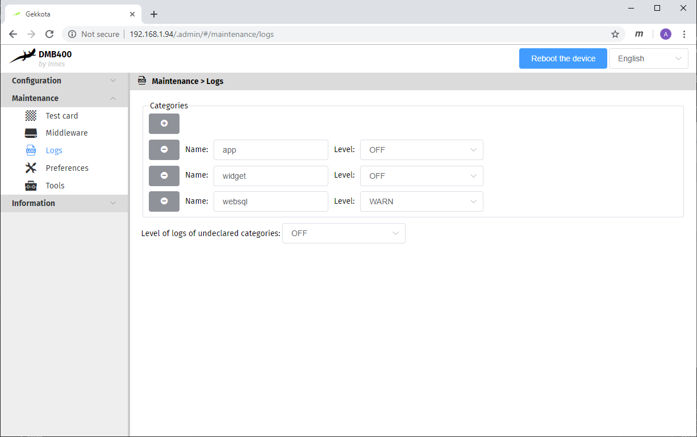
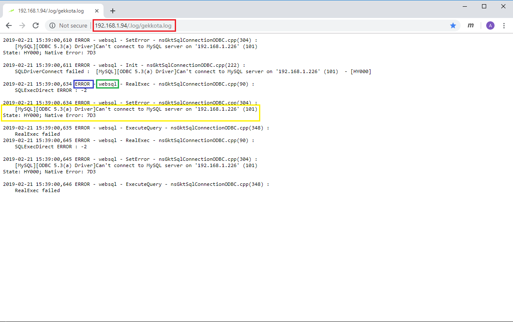

Gekkota logger
==================================

Gekkota has an internal logger for every one of its components. Sometimes the information from the logger can help you understand where the error might come from when using the examples.

# Setup the logger

First of all, go to the log tab on the WebUI of your device:

* Name field: the name of the component you want to use the logger from.
* Level field: the level of debug.
    - OFF: the logger doens't output anything,
    - ERROR: the logger outputs critical errors,
    - WARN: the logger outputs warnings, which can sometime justify critical errors,
    - DEBUG: the logger outputs everything.
    - Note: a logger in DEBUG level logs warnings and errors in addition to its own logs. Same for WARN level with errors.

If you are having troubles with one of the examples that returns an error you are trying to understand, we advise you set the corresponding logger to WARN level. In the examples provided on Github, if a logger could help you, its name will appear in the console error message.
For example, if you want to set the websql logger with level WARN, it will look like below:

# Gekkota log file

To display the log file in your browser, go to "IP_of_the_player/.log/gekkota.log" where "IP_of_the_player" is the address of your player. You can find an example below:

* In the top red rectangle is the path to access the log file,
* In the blue rectangle is the level of the log,
* In the green rectangle is name of the logger,
* In the yellow rectangle is an example of log.

In this example, the logger helps us understand that there is a problem with the SQL server.

